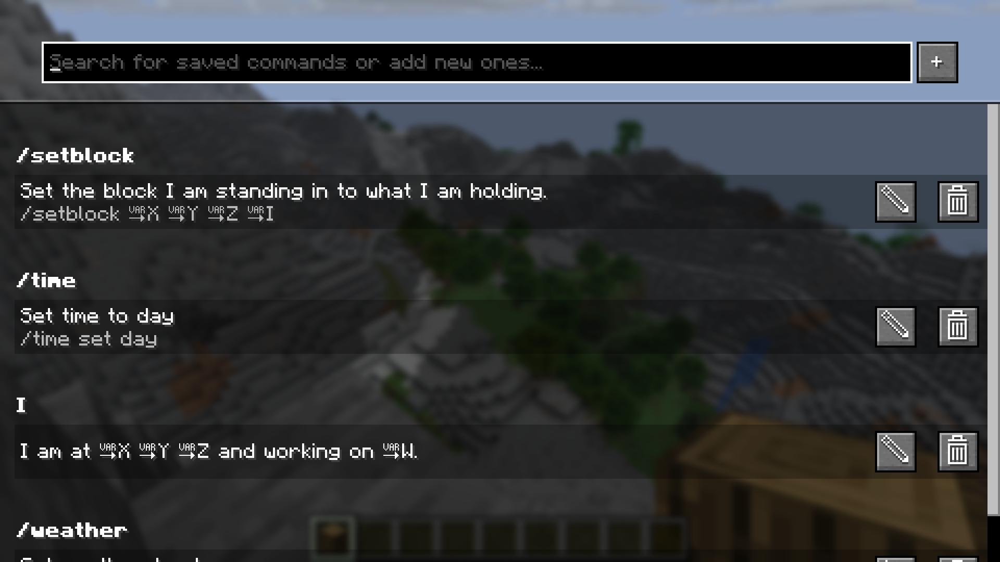
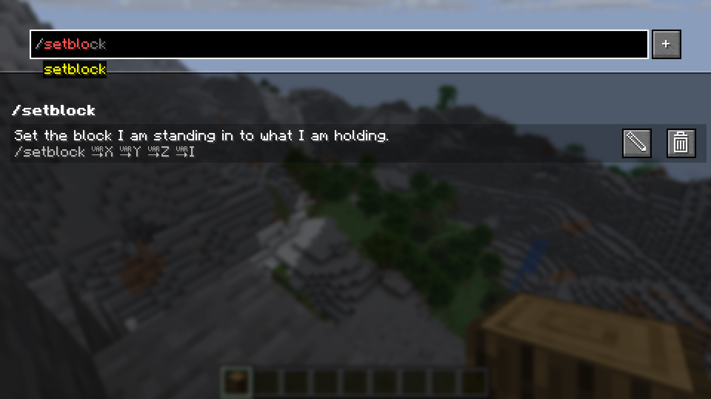
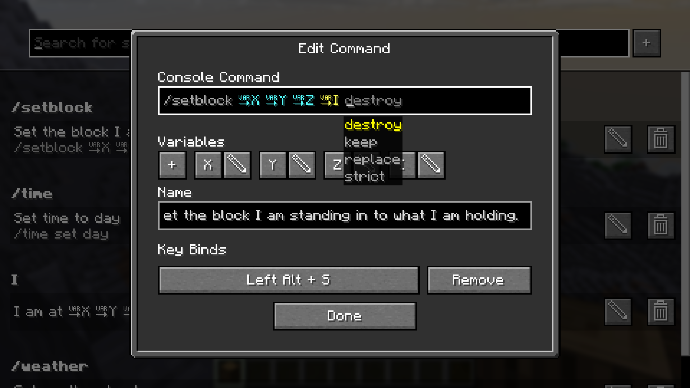
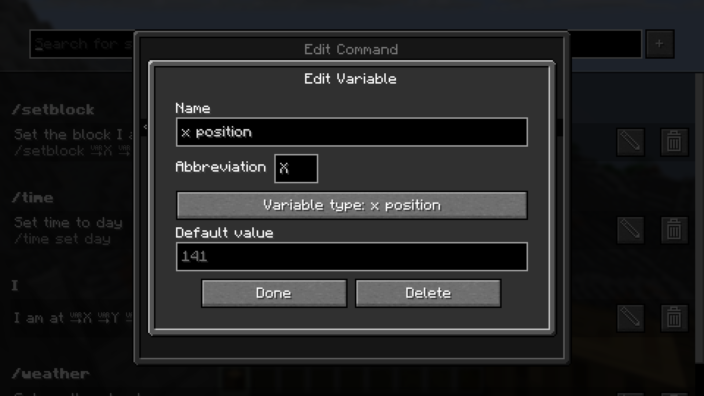
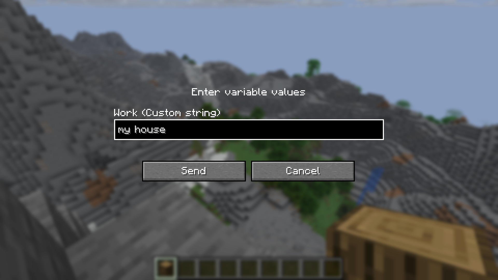

# Saved Commands

Saved Commands is a client Minecraft mod for Fabric that lets you save commands and
chat messages for easier access later using keyboard shortcuts and the
saved commands menu.

## Installation

This mod is only supported by the Fabric mod loader. For installation guides regarding
please use the official [Fabric player guides](https://docs.fabricmc.net/players/).

You can download the mod on either [Modrinth](https://modrinth.com/mod/savedcommands) or on [GitHub](https://github.com/Pr77Pr77/savedcommands)
under [releases](https://github.com/Pr77Pr77/savedcommands/releases).
This mod needs the following dependency:

[Fabric API](https://modrinth.com/mod/fabric-api) (Please pick an appropriate version for your Minecraft version)

## Using the mod

To use the mod, open the Saved Commands screen by pressing the keybind 
(defaults to Y on QWERTY and Z on QWERTZ keyboards).

On the Saved Commands screen, you can:

* Add a new command by clicking the "+"-button
* Edit saved commands by clicking on the pen icon on the right. In the appearing popup, you can edit the command,
insert variables, add or edit a name and add or edit the keybind combination (shortcut).
* Delete saved commands by clicking on the trash can icon on the right.
* Send and run commands by clicking on them
* Search for commands by entering the query into the top bar.

Variables can be used to insert player data, like the position and item id of the held item.
You can also select a data type like string, integer and float, for you to input before sending.
If you don't know these types, use string because it is the least "strict" one.

> We accept no liability for any damages caused by using this mod. Use at your own risk!

## Screenshots

*The Saved Commands screen with some example commands*

*In the top bar you can get command recommendations like in the chat*

*In the edit command screen you can edit the name, command and keybind combination*

*In the edit variable screen you can edit the name, abbreviation, variable type and defult value*

*Before sending a command or text containing a custom variable, you are prompted to input the values*

## Working principles

The following things regarding the mod might be counterintuitive:

* The mod separates every world and server from each other. This means, that you might have to set the same command up multiple times.
* If you set a keybind to one that already exists in the Minecraft keybinds, it will block the Minecraft keybind. This only applies to
the first key of a combination or if the next key of the combination is pressed (e.g. Alt + W: Alt is never triggered, W is triggered, if Alt is not pressed)
* If you set two command keybinds to the same key or key combination, the one added first will be executed.

## Reporting issues, getting help and suggesting features

If you have trouble using the mod, if you stumble upon a bug or if you want to suggest a feature to be implemented,
please don't hesitate to post an [issue on GitHub](https://github.com/Pr77Pr77/savedcommands/issues).
We will try to respond as soon as possible and maybe ask follow-up questions.
